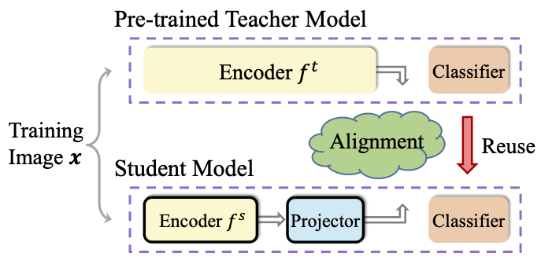
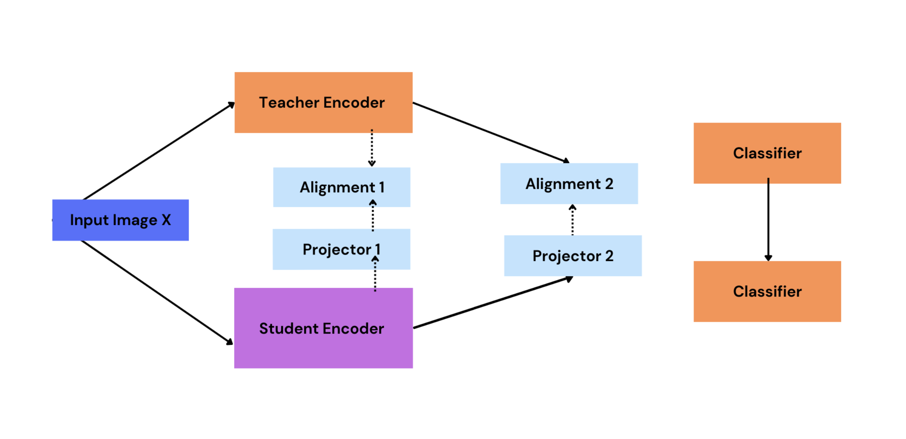
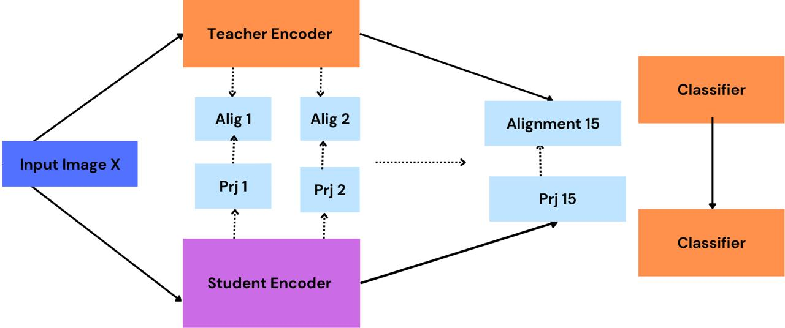

# Student Research Project: Knowledge Distillation

This is the student research project from Uni Hildesheim, Germany. The idea of the project is to focus on experiments in the domain of knowledge distillation. Knowledge distillation is a popular technique in deep learning where a smaller student network is trained to mimic the behavior of a larger, pre-trained teacher network. This method leverages the teacher’s knowledge to guide the student’s learning process, allowing for the deployment of efficient models on resource-constrained devices.

- We selected our baseline paper:[**Knowledge Distillation with the Reused Teacher Classifier(CVPR-2022)**](https://arxiv.org/abs/2203.14001) to focus our experiments on the improvement. Details of Baseline paper can be found [here](base-line-detail.md).

- Our study explores knowledge distillation using simKD model
as a baseline with diverse teacher-student architectures with varying
learning rates, loss functions, multiple projectors, labels, and unbiased
projectors to enhance feature alignment and model performance. 

<center>(Student: ResNet-8x4, Teacher: ResNet-32x4). </center>

## Experiments Details

We experimented on different configuration.

- Loss Functions - L2 Loss (SimKD), KL divergence
- Learning rates - 0.001, 0.005, 0.01, 0.05, 0.1
- Multiple Projectors (biased)
- Using labels
- All Layer projectors (unbiased)

### Multiple Projectors (biased) Architecture.



### All Layer Projector (unbiased)


Details of the experiments can be found in the slide [here](design-document/final-presentation.pdf).

## Reproduction

The details on how to reproduce can be found [here](base-line-detail.md)

## Citation
```
@misc{kd2024srp,
  author       = {Wut Hlaing and Roeber S. and Kumar A. and Abin B. and and Brhau A.},
  title        = {Knowledge Distillation in Encoder},
  year         = {2024},
  publisher    = {GitHub},
  journal      = {GitHub repository},
  howpublished = {\url{https://github.com/alexsnowschool/knowledge-distillation-project}},
}
```