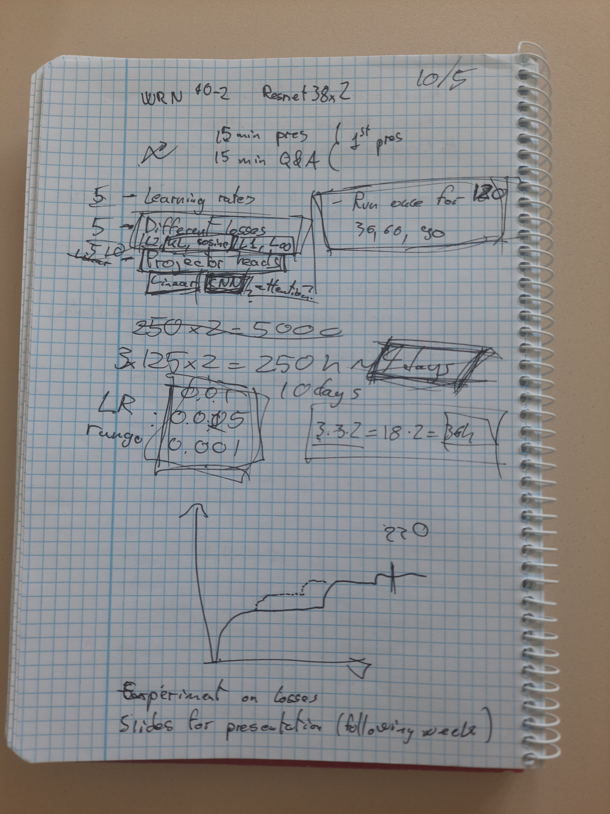

# SRP Meeting notes Friday, 10.05.2024

## Members present:
Diego, Alex, Abin, Apurv, Steve

## Experiments

Alex presented the experiments she conducted so far
* The accuracies of teacher and distilled student models are similar (within standard deviation)

Things we want to do experiments on are:
* LR (5 different LRs)
* Losses 
    * L_2, Cosine Similarity, KL-Divergence, L_1, L_inf
* Projector architectures
    * Try Linear Projectors too (Only for the last projector)
* (If possible, do 3 iterations each, so we can present standard deviations)

For the **next meeting** we want to do experiments only on:
* LR [0.01, 0.05, 0.001]
* Losses [Cosine Similarity, KL-Divergence]
* (If possible, do 3 iterations each, so we can present standard deviations)

To reduce student training time, we can try to lower the number of epochs (Try ImageNet configuration on CIFAR-100) and use the fastest running networks

## Presentation

* 15 minutes presentation + 15 minutes QnA
* Cover the base paper 
* Present our results
* Present direction we want to go in / What else we want to experiment on
* (Quickly mention data foundation -> Cifar-100)

## Diego Note for reference

